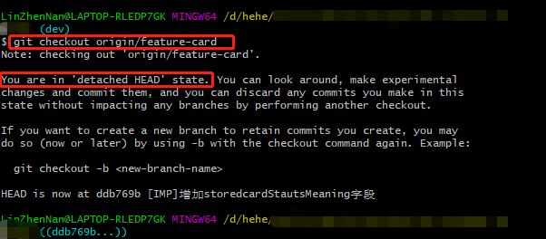
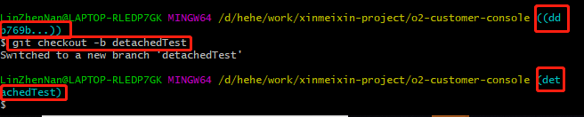

# You are in 'detached HEAD' state

误操作，出现这个现象。

## 现象



## 概念

>  git checkout 实际上是修改HEAD文件的内容，让其指向不同的branch。
> HEAD文件指向的branch就是当前branch. 

## 解决

目前不知道这个 `detached HEAD` 的实际用处，所以先解决退出这个状态。

1. 执行 `git` 语句，新建分支

   ```git
   git checkout -b detachedTest
   ```



2. 接着进入其他分支，删除新建的分支

   ```git
   git checkout master
   
   git branch -d detachedTest
   ```

   