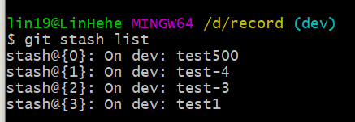
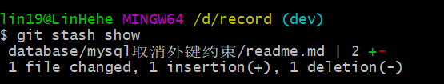
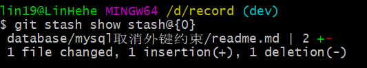
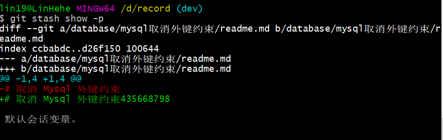
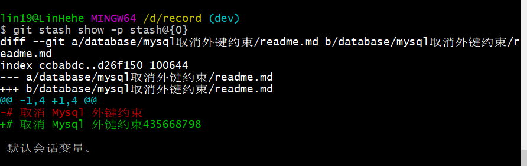

# git stash

> git-stash - Stash the changes in a dirty working directory away
>
> [git-stash 官方文档](https://git-scm.com/docs/git-stash)

将当前的工作状态保存起来，`git stash` 会缓存 **添加到暂存区的修改（staged changes）**，**Git 跟踪的但并未添加到暂存区的修改（unstaged changes）**。不会缓存 **在工作目录中新的文件（untracked files）**，**被忽略的文件（ignored files）**。使用 `-u` 或者 `--include-untracked` 可以 stash untracked 文件。使用 `-a` 或者 `--all` 命令可以 stash 当前目录下的所有修改。

## 常用命令

* [git stash list](#list)
* [git stash pop](#pop)
* [git stash apply](#apply)
* [git stash drop](#drop)
* [git stash clear](#stashClear)
* [git stash show](#show)

### <a name="list" style="text-decoration:none">git stash list</a>

git stash list，列出所有 stash

```git
git stash list
```



### <a name="save" style="text-decoration:none">git stash save</a>

git stash save '描述'，将当前的工作状态保存到 stash，不会保存 **在工作目录中新的文件（untracked files）**，**被忽略的文件（ignored files）**。

将当前的工作状态保存，并给注释 *保存一个stash*

```git
git stash save '保存一个stash'
```

### <a name="pop" style="text-decoration:none">git stash pop</a>

git stash pop [-index] [stash_id]，将指定的 stash_id 的 stash 恢复，然后会删除该 stash

将 `stash@{0}` 的 stash 恢复到工作区

```git
git stash pop stash@{0}
```

将 `stash@{0}` 的 stash 恢复到工作区和暂存区

```git
git stash pop --index stash@{0}
```

#### <a name="apply" style="text-decoration:none">git stash apply</a>

git stash apply [-index] [stash_id]，将指定的 stash_id 的 stash 恢复，不删除该 stash

将 `stash@{0}` 的 stash 恢复到工作区

```git
git stash apply stash@{0}
```

将 `stash@{0}` 的 stash 恢复到工作区和暂存区

```git
git stash apply --index stash@{0}
```

### <a name="drop" style="text-decoration:none">git stash drop </a>

git stash drop [-index] [stash_id]，删除指定的 stash_id 的 stash

将 `stash@{0}` 的 stash 删除。注意，**删除后栈顶第一个 stash 的 stash_id 会变成是 stash@{0}**

```git
git stash
```

### <a name="stashClear" style="text-decoration:none">git stash clear</a>

git stash clear，删除所有 stash

```git
git stash clear
```

### <a name="show" style="text-decoration:none">git stash show</a>

git stash show，展示与创建存储项时的提交的差异

展示栈顶 stash 的简单差异

```git
git stash show
```



展示指定 stash_id 的 stash 的简单差异，将 `stash@{0}` 的 stash 的简单差异展示

```git
git stash show stash@{0}
```



展示栈顶 stash 的详细差异

```git
git stash show -p
```



展示指定 stash_id 的 stash 的详细差异，将 `stash@{0}` 的 stash 的详细差异展示

```git
git stash show -p stash@{0}
```

