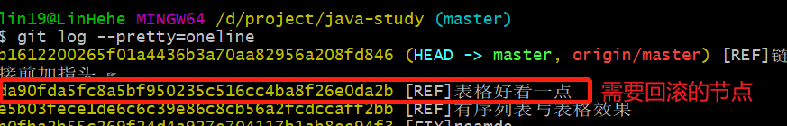
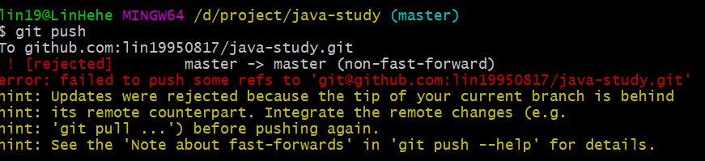
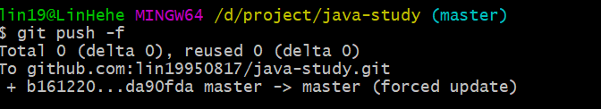

## git回滚后提交时提示先拉取
1. 查看日志
    * 命令
    ```
    // 使用简洁单行的格式查看日志
    git log --pretty=oneline
    ```
    * 结果<br/>
    
2. 回滚
    * 命令
    ```
    git reset --hard da90fda5fc8a5bf950235c516cc4ba8f26e0da2b
    ```
    * 结果<br/>
    
3. 提交。提示被拒绝并提示先拉取
    * 命令
    ```
    git push
    ```
    * 结果<br/>
    
4. 强制提交
    * 命令
    ```
    git push -f
    ```
    * 结果<br/>
    
