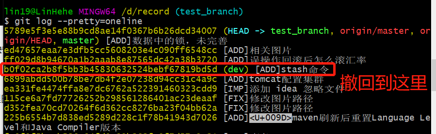
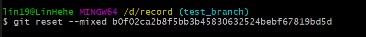
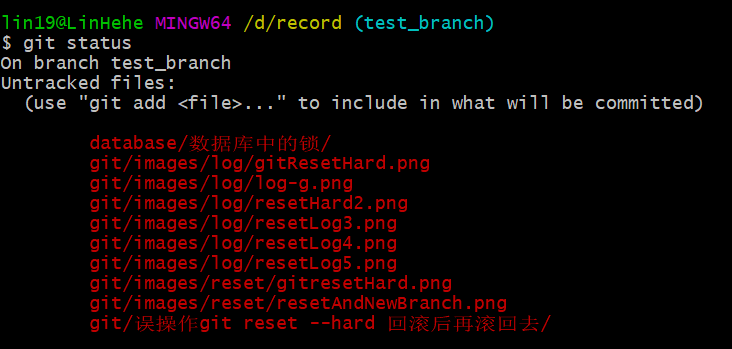
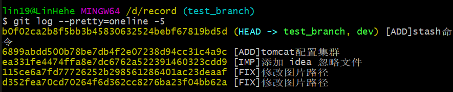

# 撤销 `commit`

1. 查看日志，撤回到指定的版本，之后的提交撤回到 **工作区**

   ```git
   git log --pretty=oneline
   ```

   

2. 使用 `git reset --mixed [版本号]` 撤销 commit。到这里撤回结束。

   ```git
   git reset --mixed b0f02ca2b8f5bb3b45830632524bebf67819bd5d
   ```

   

3. 查看当前状态，发现之后的提交都撤回到 **工作区**

   ```git
   git status
   ```

   

4. 查看日志，查看 5 条记录

   ```git
   git log --pretty=oneline -5
   ```

   