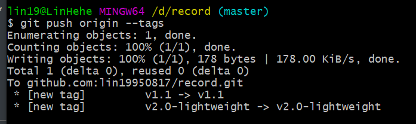

# Git 标签

[toc]

## 前言

> 像其他版本控制系统（VCS）一样，Git 可以给仓库历史中的某一个提交打上标签，以示重要。 比较有代表性的是人们会使用这个功能来标记发布结点（ `v1.0` 、 `v2.0` 等等）。 在本节中，你将会学习如何列出已有的标签、如何创建和删除新的标签、以及不同类型的标签分别是什么。

## 列出标签

在 Git 中列出已有标签，指令 `git tag`

### 匹配标签名


## 创建标签

> Git 支持两种标签：轻量标签（lightweight）与附注标签（annotated）。
>
> 轻量标签很像一个不会改变的分支——它只是某个特定提交的引用。
>
> 而附注标签是存储在 Git 数据库中的一个完整对象， 它们是可以被校验的，其中包含打标签者的名字、电子邮件地址、日期时间， 此外还有一个标签信息，并且可以使用 GNU Privacy Guard （GPG）签名并验证。 通常会建议创建附注标签，这样你可以拥有以上所有信息。但是如果你只是想用一个临时的标签， 或者因为某些原因不想要保存这些信息，那么也可以用轻量标签。

### 附注标签（annotated）

在 Git 中创建附注标签，指令 `git tag -a 标签名 -m "标签信息"`，例子如下

```git
git tag -a v1.0 -m "v1.0 message"
```


`-m` 选项指定了一条将会存储在标签中的信息。 如果没有为附注标签指定一条信息，Git 会启动编辑器要求你输入信息。

通过使用 `git show 标签名` 命令可以看到标签信息和与之对应的提交信息：


输出显示了打标签者的信息、打标签的日期时间、附注信息，然后显示具体的提交信息。

### 轻量标签

另一种给提交打标签的方式是使用轻量标签。 轻量标签本质上是将提交校验和存储到一个文件中——没有保存任何其他信息。 创建轻量标签，不需要使用 `-a`、`-s` 或 `-m` 选项，只需要提供标签名字 `git tag 标签名`，例子如下

```git
git tag v2.0-lightweight
```


这时，如果在标签上运行 `git show 标签名`，你不会看到额外的标签信息。 命令只会显示出提交信息：


## 后期打标签

对过去的提交版本打标签。指令 `git tag -a 标签名 版本号 -m "标签信息"`

先通过 `git log --pretty=online` 查看提交记录


给 `[ADD] maven` 打上标签 `v1.1`，执行 `git tag -a v1.1 0b7f842dff7669bd7e46ffb92203e3c672c13aeb -m "后期打的标签"`


查看标签信息


## 共享标签（push 标签）

默认情况下，`git push` 命令并不会传送标签到远程仓库服务器上。 在创建完标签后你必须显式地推送标签到共享服务器上。 这个过程就像共享远程分支一样。

### 共享某个标签

推送某个标签，指令 `git push origin 标签名`。


### 共享全部标签

推送全部标签，指令 `git push origin --tags`。**此推送标签并不会区分轻量标签和附注标签， 没有简单的选项能够让你只选择推送一种标签。**



## 删除标签

### 删除本地标签

要删除掉你本地仓库上的标签，可以使用命令 `git tag -d 标签名`。 例如，可以使用以下命令删除一个轻量标签：


### 删除远程标签

注意上述命令并不会从任何远程仓库中移除这个标签，你必须用 `git push origin :refs/tags/标签名` 来更新你的远程仓库：

第一种变体是 `git push origin :refs/tags/标签` ：


上面这种操作的含义是，将冒号前面的空值推送到远程标签名，从而高效地删除它。

第二种更直观的删除远程标签的方式是 `git push origin --delete 标签名`：


## 签出标签

如果你想查看某个标签所指向的文件版本，可以使用 `git checkout 标签名` 命令， 虽然这会使你的仓库处于“分离头指针（detached HEAD）”的状态——这个状态有些不好的副作用：

在“分离头指针”状态下，如果你做了某些更改然后提交它们，标签不会发生变化， 但你的新提交将不属于任何分支，并且将无法访问，除非通过确切的提交哈希才能访问。 因此，如果你需要进行更改，比如你要修复旧版本中的错误，那么通常需要创建一个新分支，指令 `git checkout -b 新分支名 标签名`


