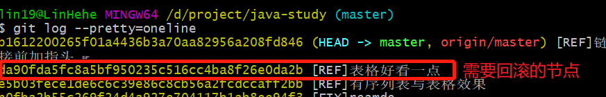

# 误操作使用 `git reset --hard` 命令回滚后，怎么撤销

## 使用 `git reset --hard` 命令回滚

1. 查看日志

   ```git
   git log --pretty=oneline
   ```

   

2. 执行回滚命令

   ```git
   git reset --hard 02bd00ac8cc21a31fb326a7d06d54d662926b2f0
   ```

   

3. 再次查看日志，查看 5 条日志

   ```git
   git log --pretty=oneline -5
   ```

   

## 滚回去

1. 使用命令 `git log -g`

   ```git
   git log -g
   ```

   

2. 执行 `git reset --hard` 滚回来

   ```git
   git rest --hard 
   ```

   

3. 查看日志，查看 5 条日志

   ```git
   git log --pretty=oneline -5
   ```

   

**在步骤 1 后可以将被误操作回滚掉的版本恢复到新分支里**

1. 将某个版本给新建的分支，`git brach [新的分支名] [版本号]`

   ```git
   git branch new_branch 9e3d552c23394ddb51289f502a37b7cf489cdb52
   ```

   

2. 切换分支后，查看日志，查看 5 条日志

   ```git
   git log --pretty=oneline -5
   ```

   