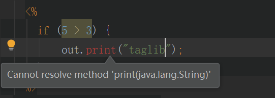
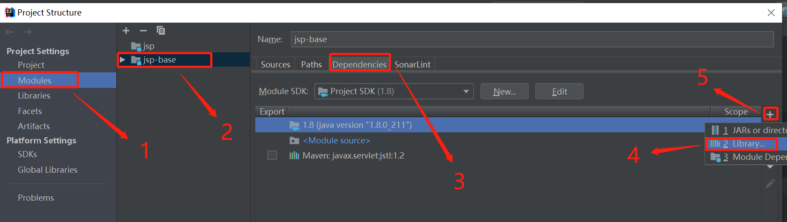
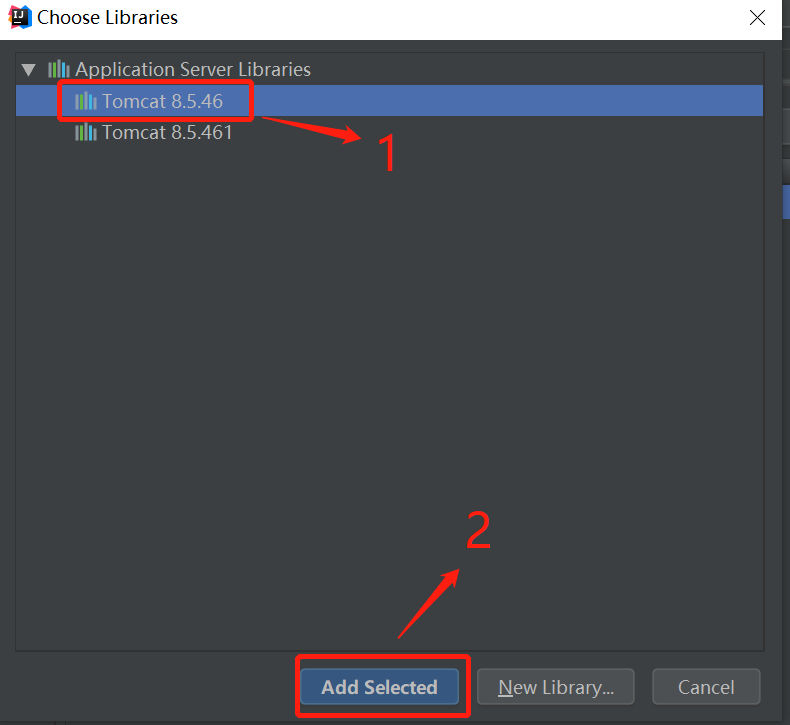

## Cannot resovle method 'print(java.lang.String)'

### 解决 1
1. 进入项目的项目结构。 **Project Settings。File -> Project Structure。**<br/>

2. 给模块添加依赖。 **Project Structure -> Modules -> 选择模块 -> Dependencies -> + -> Library**<br>

3. 添加 `Tomcat` 依赖。<br> 

### 解决 2
pom 添加依赖
```
<dependency>
    <groupId>javax.servlet.jsp</groupId>
    <artifactId>jsp-api</artifactId>
    <version>2.2</version>
    <scope>provided</scope>
</dependency>
```