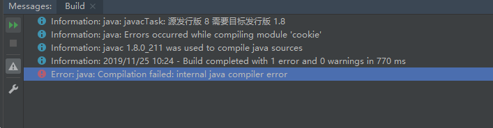
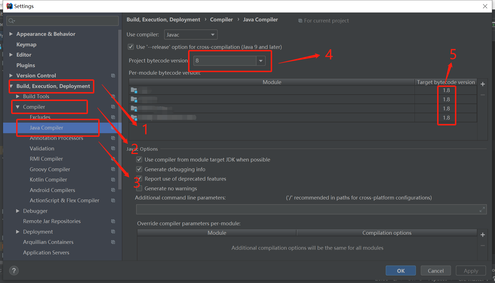

## java: Compilation failed: internal java compiler error
Error:java: Compilation failed: internal java compiler error 

### 原因
导致这个错误的原因主要是因为jdk版本问题。编译版本不匹配。
### 解决
1. 进入设置。 **File -> Settings**。 

2. 进入 java 编译，选择编译版本。**Settings -> Build, Execution, Deployment -> Compiler -> Java Compiler -> Project bytecode version**。 
