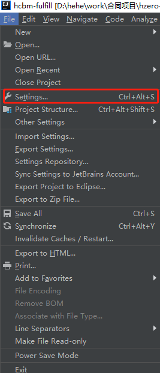
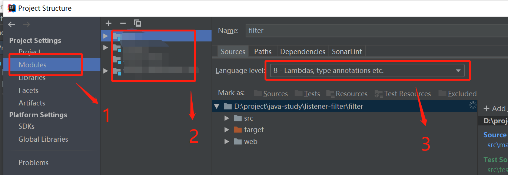

# maven 刷新后重置 Language Level 和 Java Compiler 版本

## 原因

```
Apache Maven Compiler Plugin

The Compiler Plugin is used to compile the sources of your project. Since 3.0, the default compiler is javax.tools.JavaCompiler (if you are using java 1.6) and is used to compile Java sources. If you want to force the plugin using javac, you must configure the plugin option forceJavacCompilerUse.

Also note that at present the default source setting is 1.5 and the default target setting is 1.5, independently of the JDK you run Maven with. If you want to change these defaults, you should set source and target as described in Setting the -source and -target of the Java Compiler.
```

## 解决

* ### 方案一

  在 `pom.xml` 中指定 `compiler` 的版本

  ```xml
  <build>
      <plugins>
          <plugin>
              <groupId>org.apache.maven.plugins</groupId>
              <artifactId>maven-compiler-plugin</artifactId>
              <version>2.3.2</version>
              <configuration>
                  <source>1.8</source>
                  <target>1.8</target>
              </configuration>
          </plugin>
      </plugins>
  </build>
  ```

  简洁版本

  ```xml
  <properties>
    <maven.compiler.source>1.8</maven.compiler.source>
    <maven.compiler.target>1.8</maven.compiler.target>
  </properties>
  ```

* 方案二

  1. 进入 `settings`。

     

     2. 设置 `java Compiler`。

        

     3. 进入 `Project Structure`。

        

     4. 设置 `Modeules`。

        