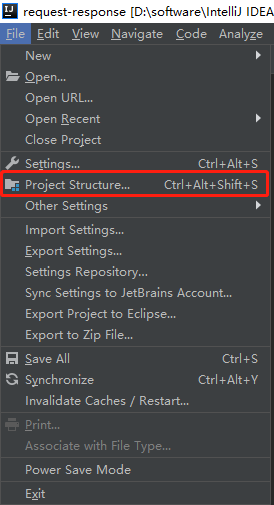
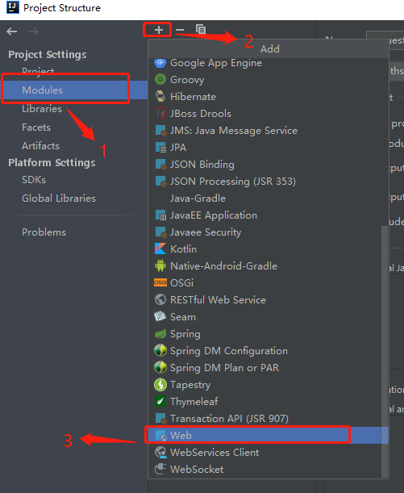
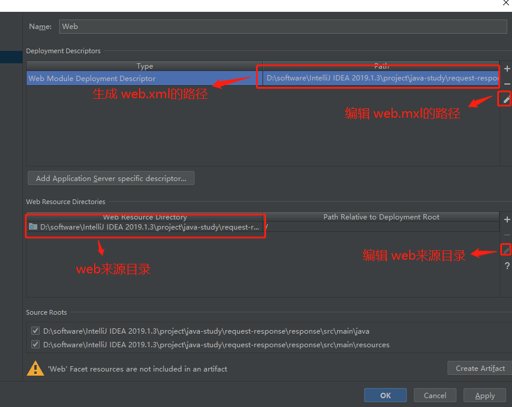
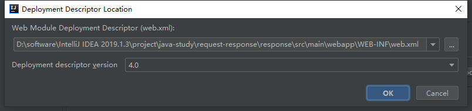
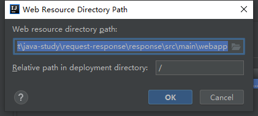

## maven工程转 web项目
1. 进入maven项目的项目结构 **Project Settings。File -> Project Structure。** 

2. 添加 web模块。**Project Structure -> Modules -> + -> web。** 若有多个模块要先选择（点击）需要转 web工程的模块，再点击 `+`。 

3. 设置 web module Deployment Descritptor和 web resource directories。 

    1. web module Deployment Descriptor 
    
    2. web resource directories 
    
