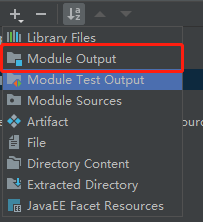

# maven模块依赖后，tomcat启动缺报错ClassNotFoundException

`tomcat` 启动都可以按这个方法添加 `jar`，在 **解决的步骤3** 中 `WEB-INF` 下新建 `lib` 文件夹，在此文件夹里添加 `jar`。

## 现象

1. 父工程下两个 maven 工程

   

2. `pom` 依赖，`session` 工程依赖 `cookie` 

   

3. 错误

   

## 解决

1. 进入 `Project Structure`。**File -> Project Structure**

   

2. 进入 `Artifacts` 为 `session` 添加 `Output Layout`。

   

   

   

3. 结果

   