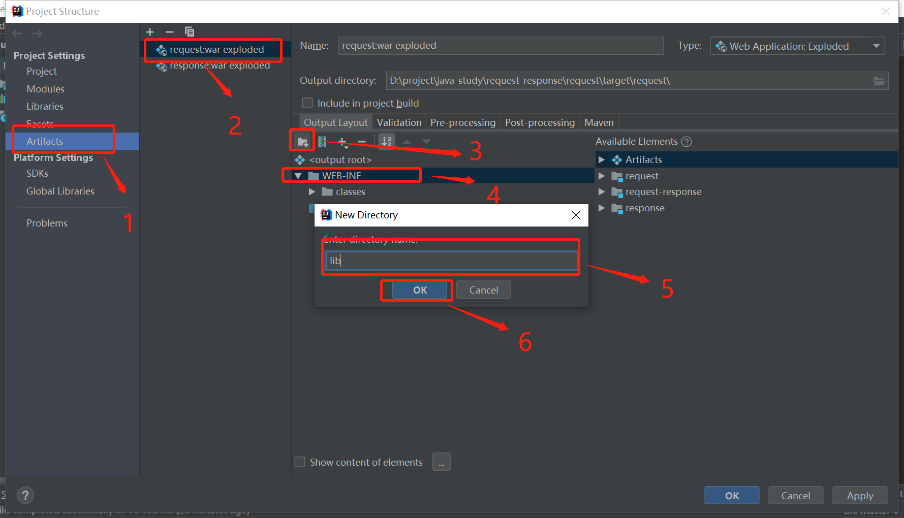
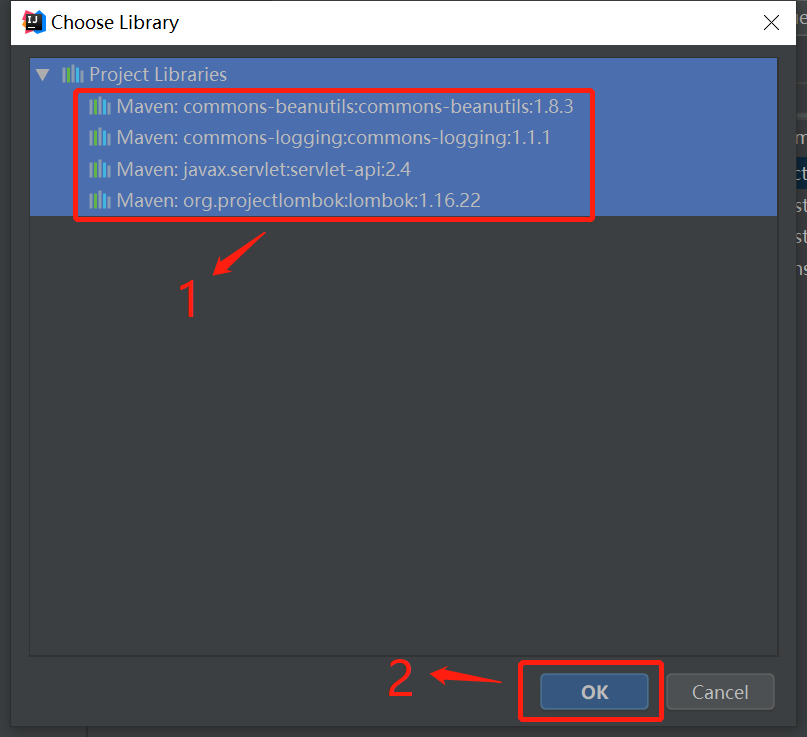

## maven工程转 web项目后，maven添加的依赖并没有导入项目
报错是某个类找不到，但开发环境（idea）没报错。
### 解决：
1. 进入 maven项目的项目结构。 **Project Settings。File -> Project Structure。** 
   
2. 进入项目结构的 Artifacts，选择 war然后选择 WEB-INF目录并在该目录下新建名为 lib的文件夹用于存放 jar。 **Project Structure -> Artifacts -> war exploded -> WEB-INF -> 新建文件夹(命名 lib)。**
   
3. 选择你需要导入的 jar。
   
4. 确定后重启 tomcat。
