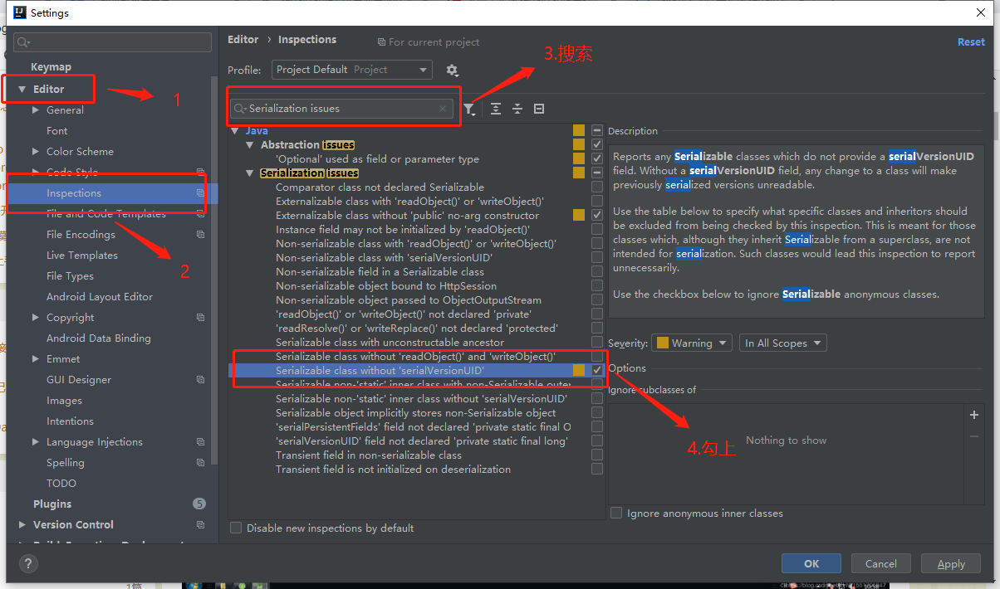
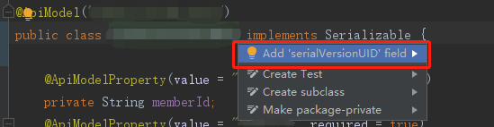

# idea 如何为实现 **Serializable** 接口的类添加 **serialVersionUID**

1. 进入 `settings`

   

2. 进入 `inspections`，勾上 `Serializable class without 'serialVersionUID'`。

   

3. `alt + enter` 提示选择 `Add 'serialVersionUID' Field`。

   