# maven

[TOC]

## maven 介绍

Maven 项目对象模型(POM)，可以通过一小段描述信息来管理项目的构建，报告和文档的项目管理工具软件。

Maven 是一个跨平台的项目管理工具，它是使用 java 开发的，它要依赖 jdk1.6 及以上。

Maven 主要有两大功能：**管理依赖、项目构建**

* 管理依赖：依赖指的是 jar 包
* 项目构建：构件过程值得是 **清理、编译、测试、报告、打包、部署**

## maven 安装配置

[官网下载地址](https://maven.apache.org/download.cgi)，[maven 3.1+ 官网下载地址](https://downloads.apache.org/maven/maven-3/)

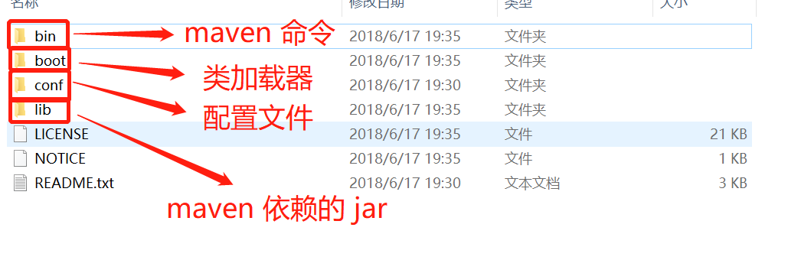

### 全局配置

全局配置文件路径 `maven目录\conf\settings.xml`。

#### 设置本地仓库

在全局配置文件中添加 `<localRepository>本地仓库地址</localRepository>`。

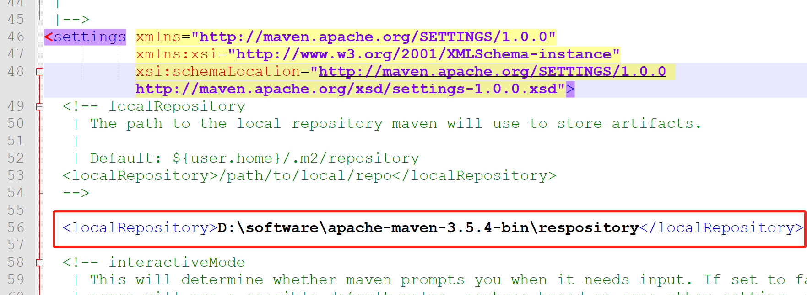

#### 设置远程仓库镜像

设置阿里云远程仓库镜像。

```xml
<mirror>
    <id>alimaven</id>
    <name>aliyun maven</name>
    <url>http://maven.aliyun.com/nexus/content/groups/public/</url>
    <mirrorOf>central</mirrorOf>
</mirror>
```

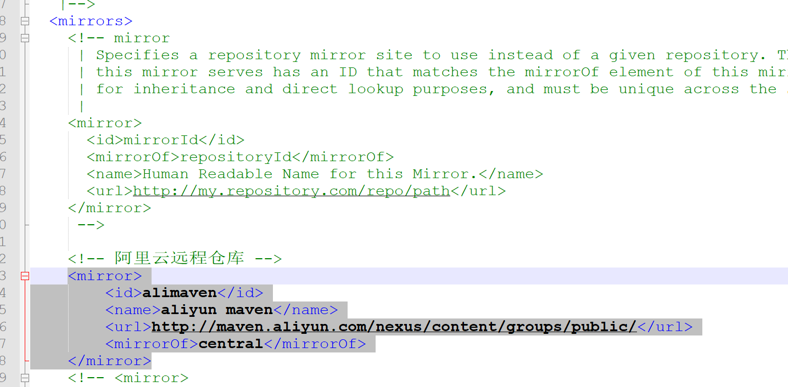

### 用户配置

用户配置文件位置在 `用户文档\.m2\settings.xml`。默认没有该文件，需要将全局配置文件拷贝过来再进行修改。

**用户级别的仓库在全局配置中一旦设置，全局配置将不再生效，转用用户所设置的仓库，否则使用全局配置文件中的默认路径仓库。**

## maven 命令

需要在 pom.xml 所在目录总执行命令。

### mvn compile

编译项目，执行完毕后，会在根目录下生产 target 目录，该目录中存放编译后文件。

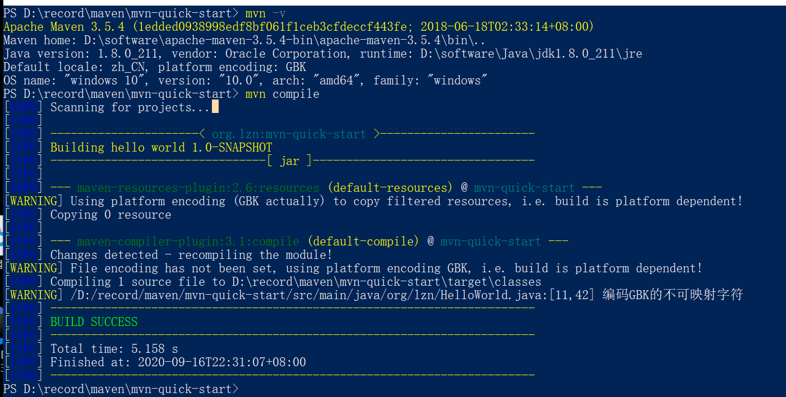

### mvn clean

清理项目的编译文件，就是 target 目录。

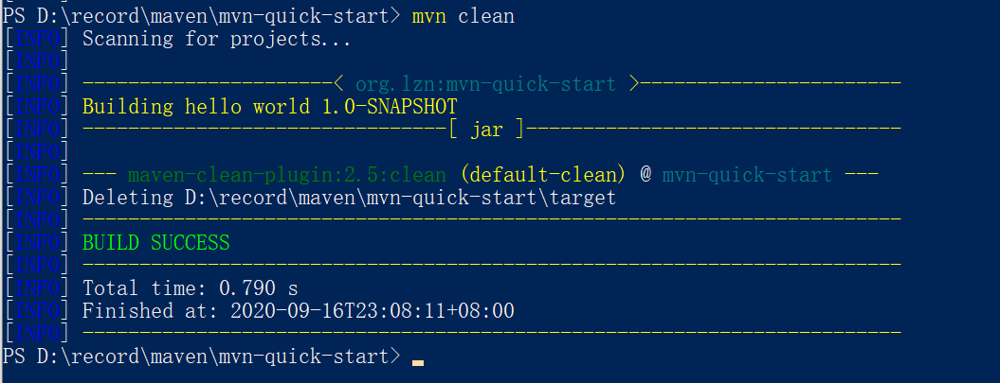

### mvn test

完成单元测试操作，执行完毕后会在 target 目录中生产三个文件夹，surefire、surefire-reports（测试报告）、test-class（测试的字节码文件）

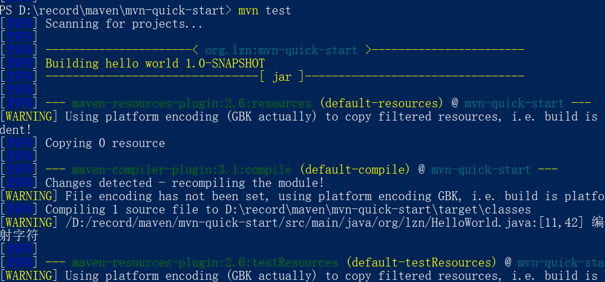

### mvn package

打包，执行完毕后，会在 target 目录中生成一个文件 jar 或者 war。

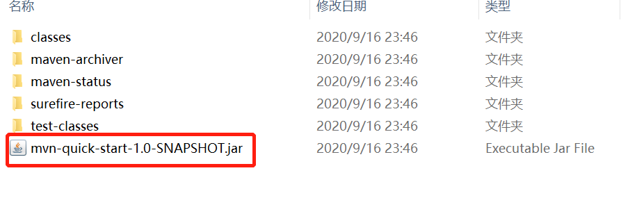

### mvn install

打包并安装到本地仓库。执行完毕后，本地仓库将出现 jar 包。

## maven 核心概念

maven 工程信息在 pom.xml 中配置。

### 坐标

* groupId：定义当前 maven 组织名称
* artifactId：定义实际项目名称
* version：定义当前项目的当前版本

### 依赖管理

#### 依赖范围

| 依赖范围（Scope） | 对于主代码 classpath 有效 | 对于测试代码 classpath 有效 | 被打包，对于运行时 classpath 有效 |
| ----------------- | ------------------------- | --------------------------- | --------------------------------- |
| compile           | Y                         | Y                           | Y                                 |
| test              | N                         | Y                           | N                                 |
| provided          | Y                         | Y                           | N                                 |
| runtime           | N                         | N                           | Y                                 |
| system            | Y                         | Y                           | N                                 |
| import            | N                         | N                           | N                                 |

使用 `<scope>` 来控制依赖范围

* compile：编译依赖范围。默认值，对于编译，测试，运行三种 classpath 都有效

* test：测试依赖范围。只对于测试 classpath 有效

* provide：已提供依赖范围。对于编译，测试的 classpath 都有效，但对于运行无效。因为由容器已经提供

* runtime：运行时提供。

* system：系统依赖范围。系统依赖范围必须通过配置systemPath元素来显示指定依赖文件的路径，此类依赖不是由maven仓库解析的，而且往往与本机系统绑定，可能造成构件的不可移植，因此谨慎使用，systemPath元素可以引用环境变量

  ```xml
  <dependency>
      <groupId>javax.sql</groupId>
      <artifactId>jdbc-stext</artifactId>
      <version>2.0</version>
      <scope>system</scope>
      <systemPath>${java.home}/lib/rt.jar</systemPath> 
  </dependency>
  ```

* import：导入依赖范围。该依赖范围不会对三种classpath产生影响，该依赖范围只能与dependencyManagement元素配合使用，其功能为将目标pom文件中dependencyManagement的配置导入合并到当前pom的dependencyManagement中。

#### 依赖传递

在 B 工程中依赖 A 工程，C 工程依赖 B 工程。则称 B 为 C 的 **直接依赖/第一直接依赖**，而称 A 为 C 的 **间接依赖/第二直接依赖**。

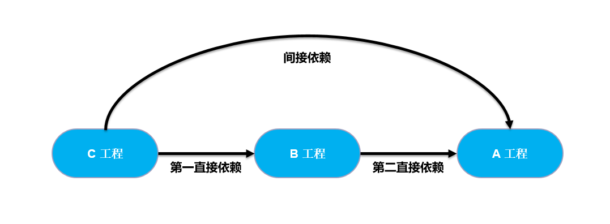

**影响**

| 列时第一直接依赖范围\\<br/>行时第二直接以来范围 | compile  | test | provided | runtime  |
| ----------------------------------------------- | -------- | ---- | -------- | -------- |
| compile                                         | compile  | -    | -        | runtime  |
| test                                            | test     | -    | -        | test     |
| provided                                        | provided | -    | provided | provided |
| runtime                                         | runtime  | -    | -        | runtime  |

#### 依赖冲突

* 如果直接与间接依赖中包含有同一个坐标不同版本的资源依赖，以直接依赖的版本为准（**就近原则**）

  例如 A 工程的 a 依赖为 1.0 版本，则 C 工程的 a 依赖为 1.0 版本。A 工程的 a 依赖为 1.0 版本，B 工程的 a 依赖为 1.1 版本，则 C 工程的 a 依赖为 1.1 版本。

* 如果直接依赖中包含有同一个坐标不同版本的资源依赖，以配置顺序下方的版本为准（**就近原则**）

  如下图，则 junit 为 4.11 版本。

  ```xml
  <dependency>
      <groupId>junit</groupId>
      <artifactId>junit</artifactId>
      <version>4.12</version>
  </dependency>
  <dependency>
      <groupId>junit</groupId>
      <artifactId>junit</artifactId>
      <version>4.11</version>
  </dependency>
  ```

#### 可选依赖

使用 `<optional>` 标签来设置是否向下传递。如果是 true 则不传递，如果是 false 就传递，默认为false。

```xml
<dependency>
    <groupId>junit</groupId>
    <artifactId>junit</artifactId>
    <version>4.11</version>
	<!-- 如果是 true 则不传递，如果是 false 就传递 -->
	<optional>true</optional>
</dependency>
```

#### 排除依赖

排除 B 工程中的 A 依赖。

```xml
<dependency>
    <groupId>org.lzn</groupId>
    <artifactId>B</artifactId>
    <version>1.0.0</version>
    <exclusions>
		<exclusion>
			<groupId>org.lzn</groupId>
			<artifactId>A</artifactId>
		</exclusion>
    </exclusions>
</dependency>
```

### 生命周期

Maven 生命周期就是为了 **对所有的构建过程进行抽象和统一**。包括 **项目清理、初始化、编译、打包、测试、部署** 等几乎所有构建步骤。

**生命周期可以理解为构建工程的步骤。**

Maven中有三套 **相互独立** 的生命周期

* Clean Lifecycle：在进行真正的构件之前进行一些清理工作
* Default Lifecycle：构建的核心部分，编译，测试，打包，部署等等
* Site Lifecycle：生成项目报告，站点，发布站点

#### clean 清理项目

**每套生命周期都由一组阶段(Phase)组成**，我们平时在命令行输入的命令总会对应于一个特定的阶段。比如，运行 mvn clean ，这个的 clean 是 Clean 生命周期的一个阶段。有 Clean 生命周期，也有 clean 阶段。Clean 生命周期一共包含了三个阶段：

* pre-clean：执行一些需要在 clean 之前完成的工作 
* clean：移除所有上一次构建生成的文件
* post-clean：执行一些需要在 clean 之后立刻完成的工作

mvn clean 中的 clean 就是上面的 clean，在一个生命周期中，运行某个阶段的时候，它之前的所有阶段都会被运行，也就是说，mvn clean 等同于 mvn pre-clean clean ，如果我们运行 mvn post-clean ，那么 pre-clean，clean 都会被运行。这是 Maven 很重要的一个规则，可以大大简化命令行的输入。

#### default 构建项目

* validate 
* generate-sources 
* process-sources 
* generate-resources 
* process-resources 复制并处理资源文件，至目标目录，准备打包。 
* compile 编译项目的源代码。 
* process-classes 
* generate-test-sources 
* process-test-sources 
* generate-test-resources 
* process-test-resources 复制并处理资源文件，至目标测试目录。 
* test-compile 编译测试源代码。 
* process-test-classes 
* test 使用合适的单元测试框架运行测试。这些测试代码不会被打包或部署。 
* prepare-package 
* package 接受编译好的代码，打包成可发布的格式，如 JAR 。 
* pre-integration-test 
* integration-test 
* post-integration-test 
* verify 
* install 将包安装至本地仓库，以让其它项目依赖。 
* deploy 将最终的包复制到远程的仓库，以让其它开发人员与项目共享。 

运行任何一个阶段的时候，它前面的所有阶段都会被运行，这也就是为什么我们运行 mvn install 的时候，代码会被编译，测试，打包。此外，Maven 的插件机制是完全依赖 Maven 的生命周期的，因此理解生命周期至关重要。

#### site 生成项目站点

site 声明周期

* pre-site 执行一些需要在生成站点文档之前完成的工作 
* site 生成项目的站点文档 
* post-site 执行一些需要在生成站点文档之后完成的工作，并且为部署做准备 
* site-deploy 将生成的站点文档部署到特定的服务器上 

这里经常用到的是 site 阶段和 site-deploy 阶段，用以生成和发布 Maven 站点，这可是 Maven 相当强大的功能，Manager 比较喜欢，文档及统计数据自动生成

### 插件

Maven 的核心仅仅定义了抽象的生命周期，具体的任务都是交由插件完成的。每个插件都能实现一个功能，每个功能就是一个插件目标。Maven 的生命周期与插件目标相互绑定，以完成某个具体的构建任务。

#### maven 编译插件

compile 就是插件 maven-compiler-plugin 的一个插件目标。

例如 指定使用 JDK1.8 编译，编码使用 UTF-8

```xml
<build>
	<plugins>
		<plugin>
			<groupId>org.apache.maven.plugins</groupId>
			<artifactId>maven-compiler-plugin</artifactId>
			<configuration>
				<source>1.8</source>
				<target>1.8</target>
				<encoding>UTF-8</encoding>
			</configuration>
		</plugin>
	</plugins>
</build>
```

#### tomcat 插件

内置 tomcat，默认 tomcat6。

配置 tomcat7

```xml
<plugin>
	<groupId>org.apache.tomcat.maven</groupId>
	<artifactId>tomcat7-maven-plugin</artifactId>
	<configuration>
		<port>8080</port>
		<path>/</path>
	</configuration>
</plugin>
```

**IDEA maven设置**

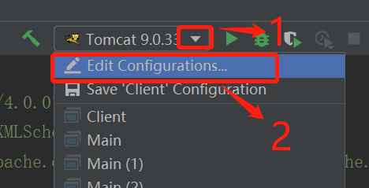

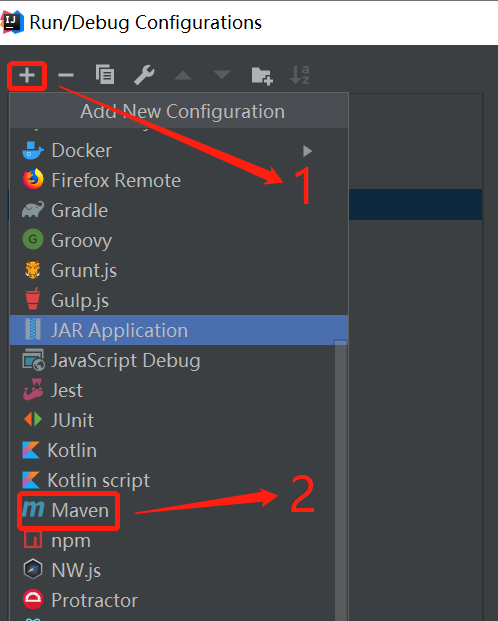

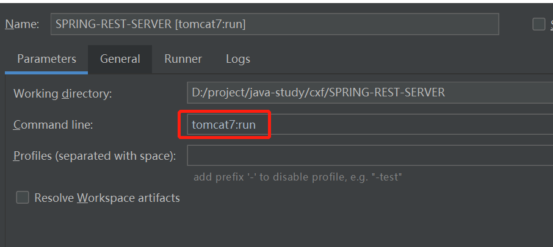

### 继承

maven 工程可以继承另一个 maven 工程。

为了消除重复，可以把很多相同的配置提取出来。例如 groupId, version 等。

#### 父工程

空白的父工程。**packaging 标签的值为 pom**。

```xml
<?xml version="1.0" encoding="UTF-8"?>
<project xmlns="http://maven.apache.org/POM/4.0.0"
         xmlns:xsi="http://www.w3.org/2001/XMLSchema-instance"
         xsi:schemaLocation="http://maven.apache.org/POM/4.0.0 http://maven.apache.org/xsd/maven-4.0.0.xsd">
    <!--版本：4.0.0-->
    <modelVersion>4.0.0</modelVersion>
    <!--组织名称：按照访问路径规范设置，通常以功能名作为名称-->
    <groupId>org.lzn</groupId>
    <!--项目名称-->
    <artifactId>parent</artifactId>
    <!--当前项目版本号-->
    <version>1.0-SNAPSHOT</version>

    <!--打包类型 jar, war, pom-->
    <packaging>pom</packaging>

    <!--名称，可省略-->
    <name>parent</name>
</project>
```

#### 子工程

在子工程里添加父工程的 groupId, artifactId, version

```xml
<?xml version="1.0" encoding="UTF-8"?>
<project xmlns="http://maven.apache.org/POM/4.0.0"
         xmlns:xsi="http://www.w3.org/2001/XMLSchema-instance"
         xsi:schemaLocation="http://maven.apache.org/POM/4.0.0 http://maven.apache.org/xsd/maven-4.0.0.xsd">
    <!--父工程的节点-->
    <parent>
        <artifactId>parent</artifactId>
        <groupId>org.lzn</groupId>
        <version>1.0-SNAPSHOT</version>
    </parent>
    
    <modelVersion>4.0.0</modelVersion>
    <artifactId>son</artifactId>
</project>
```

#### 父工程统一依赖 jar 包

父工程中对 jar 包的依赖，在子工程中 **都会被继承**。

```xml
<?xml version="1.0" encoding="UTF-8"?>
<project xmlns="http://maven.apache.org/POM/4.0.0"
         xmlns:xsi="http://www.w3.org/2001/XMLSchema-instance"
         xsi:schemaLocation="http://maven.apache.org/POM/4.0.0 http://maven.apache.org/xsd/maven-4.0.0.xsd">
    <!--版本：4.0.0-->
    <modelVersion>4.0.0</modelVersion>
    <!--组织名称：按照访问路径规范设置，通常以功能名作为名称-->
    <groupId>org.lzn</groupId>
    <!--项目名称-->
    <artifactId>parent</artifactId>
    <!--当前项目版本号-->
    <version>1.0-SNAPSHOT</version>

    <!--打包类型 jar, war, pom-->
    <packaging>pom</packaging>

    <!--名称，可省略-->
    <name>parent</name>
    
    <dependencies>
        <dependency>
            <groupId>junit</groupId>
            <artifactId>junit</artifactId>
            <version>4.12</version>
            <scope>test</scope>
        </dependency>
    </dependencies>
</project>
```

当父工程如上配置时，子工程也会继承 junit 的依赖。

#### 父工程统一管理版本号

maven 工程可以使用 dependencyManagement 标签来管理依赖的版本号。

**此处只是定义依赖的版本号，并不实际依赖。如果子工程中需要依赖 jar 包还需要添加 dependency 节点。**

**父工程**

```xml
<?xml version="1.0" encoding="UTF-8"?>
<project xmlns="http://maven.apache.org/POM/4.0.0"
         xmlns:xsi="http://www.w3.org/2001/XMLSchema-instance"
         xsi:schemaLocation="http://maven.apache.org/POM/4.0.0 http://maven.apache.org/xsd/maven-4.0.0.xsd">
    <!--版本：4.0.0-->
    <modelVersion>4.0.0</modelVersion>
    <!--组织名称：按照访问路径规范设置，通常以功能名作为名称-->
    <groupId>org.lzn</groupId>
    <!--项目名称-->
    <artifactId>parent</artifactId>
    <!--当前项目版本号-->
    <version>1.0-SNAPSHOT</version>

    <!--打包类型 jar, war, pom-->
    <packaging>pom</packaging>

    <!--名称，可省略-->
    <name>parent</name>
    
    <dependencyManagement>
        <dependencies>
            <dependency>
                <groupId>junit</groupId>
                <artifactId>junit</artifactId>
                <version>4.12</version>
            </dependency>
        </dependencies>
    </dependencyManagement>
</project>
```

**子工程**

```xml
<?xml version="1.0" encoding="UTF-8"?>
<project xmlns="http://maven.apache.org/POM/4.0.0"
         xmlns:xsi="http://www.w3.org/2001/XMLSchema-instance"
         xsi:schemaLocation="http://maven.apache.org/POM/4.0.0 http://maven.apache.org/xsd/maven-4.0.0.xsd">
    <!--父工程的节点-->
    <parent>
        <artifactId>parent</artifactId>
        <groupId>org.lzn</groupId>
        <version>1.0-SNAPSHOT</version>
    </parent>
    
    <modelVersion>4.0.0</modelVersion>
    <artifactId>son</artifactId>
    
    <dependencies>
        <dependency>
            <!--使用父工程定义的依赖，不需要指定版本号-->
            <groupId>junit</groupId>
            <artifactId>junit</artifactId>
        </dependency>
    </dependencies>
</project>
```

#### 父工程中版本号提取

当父工程中定义的 jar 包越来越多，找起来越来越麻烦，所以可以把版本号提取成一个属性集中管理。

```xml
<?xml version="1.0" encoding="UTF-8"?>
<project xmlns="http://maven.apache.org/POM/4.0.0"
         xmlns:xsi="http://www.w3.org/2001/XMLSchema-instance"
         xsi:schemaLocation="http://maven.apache.org/POM/4.0.0 http://maven.apache.org/xsd/maven-4.0.0.xsd">
    <!--版本：4.0.0-->
    <modelVersion>4.0.0</modelVersion>
    <!--组织名称：按照访问路径规范设置，通常以功能名作为名称-->
    <groupId>org.lzn</groupId>
    <!--项目名称-->
    <artifactId>parent</artifactId>
    <!--当前项目版本号-->
    <version>1.0-SNAPSHOT</version>

    <!--打包类型 jar, war, pom-->
    <packaging>pom</packaging>

    <!--名称，可省略-->
    <name>parent</name>
    
    <!--properties 的子标签可以自由指定，例如 junit.version-->
    <properties>
    	<junit.version>4.12</junit.version>
    </properties>
    
    <dependencyManagement>
        <dependencies>
            <dependency>
                <groupId>junit</groupId>
                <artifactId>junit</artifactId>
                <!--使用 ${properties 子标签} 来引用 properties 的子标签的值-->
                <version>${junit.version}</version>
            </dependency>
        </dependencies>
    </dependencyManagement>
</project>
```

### 聚合

聚合一般是一个工程拆分成多个模块开发，每个模块是一个独立的工程，但是要是运行时必须把所有模块聚合到一起才是一个完整的工程，此时可以使用maven的聚合工程。

例如电商项目中，包括商品模块、订单模块、用户模块等。就可以对不同的模块单独创建工程，最终在打包时，将不同的模块聚合到一起。

例如同一个项目中的表现层、业务层、持久层，也可以分层创建不同的工程，最后打包运行时，再聚合到一起。

## maven 仓库管理

用来统一存储所有 Maven 共享构建的位置就是仓库。根据 Maven 坐标定义每个构建在仓库中唯一存储路径大致为：groupId/artifactId/version/artifactId-version.packaging

### 本地仓库

每个用户只有一个本地仓库

### 远程仓库

* 中央仓库：Maven 默认的远程仓库，不包含版权资源。
* 私服：是一种特殊的远程仓库，他是架构在局域网内的仓库