# Nginx 配置 tomcat 集群

使用 `Nginx` 搭建 `Tomcat` 集群，并完成负载均衡。

## Tomcat 配置

### 下载

[https://tomcat.apache.org/download-80.cgi](https://tomcat.apache.org/download-80.cgi)

### 安装

如下安装两个 `tomcat`。

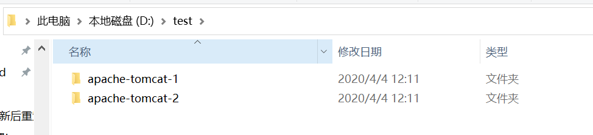

### 配置环境变量（可跳过）

1. 打开 **我的电脑** 的 **属性**，点击 **高级系统设置**。

   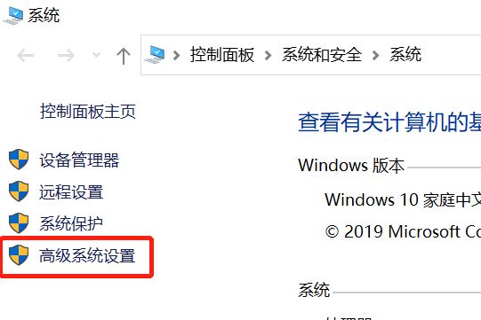

2. 在 **高级** 选项卡中，点击 **环境变量**。

   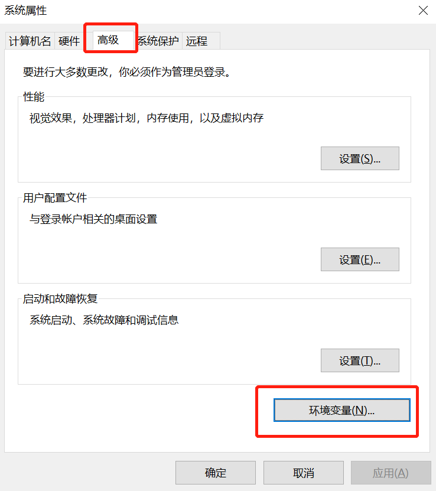

3. 选择 **环境变量** 的 新建。

   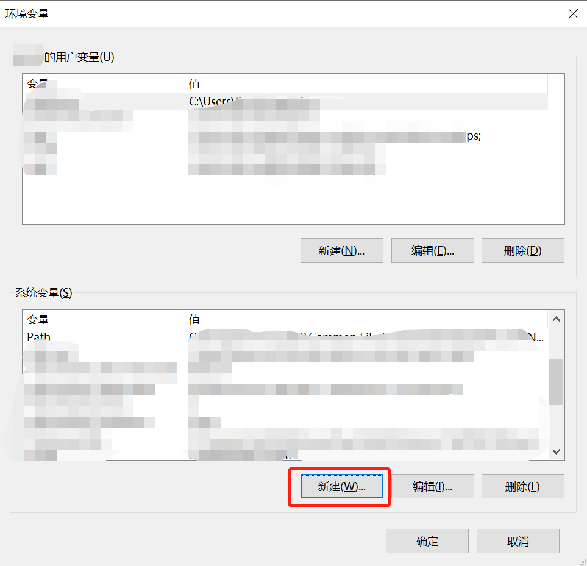

4. 新建如下的两个 **环境变量**。

   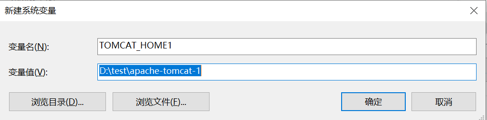

   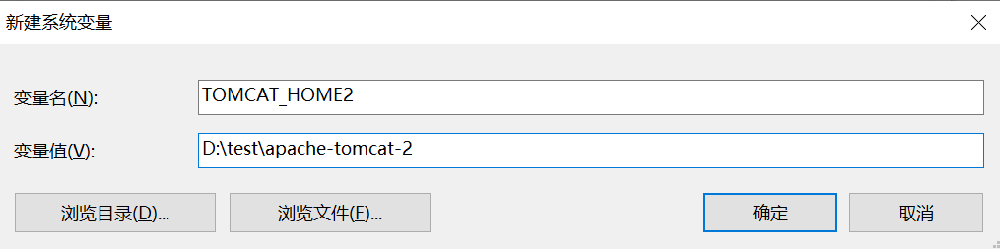

5. 选择 **环境变量** 的 **Path**，点击编辑。

   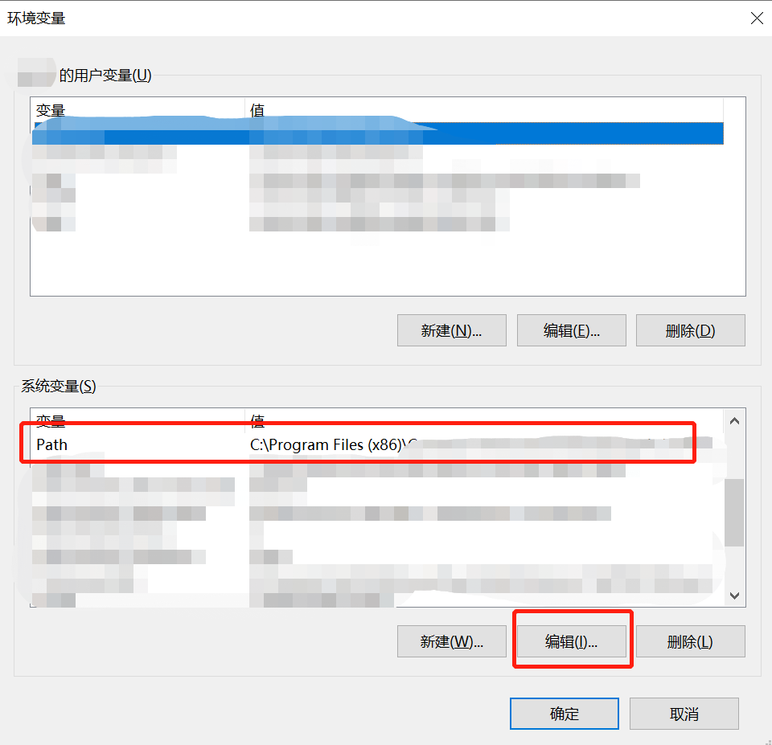

6. 添加如下 **Path 环境变量**。

   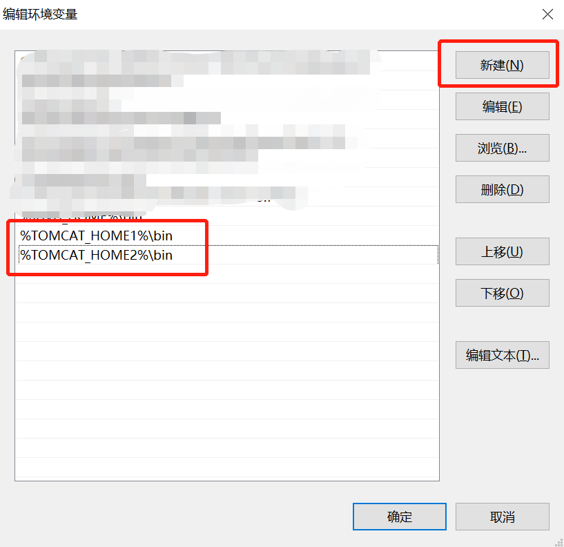

### 配置 Tomcat

将两个 `tomcat` 设置不同端口。

编辑 **Tomcat** 安装目录下的 **config** 文件夹下的 **server.xml**

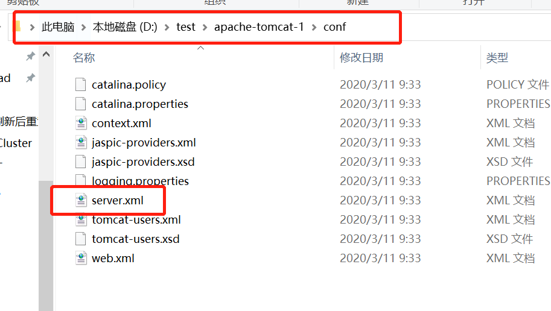

* apache-tomcat-1 修改以下标签端口号

  * `<Server port="8006" shutdown="SHUTDOWN">`
* `<Connector port="8081" protocol="HTTP/1.1"
                   connectionTimeout="20000"
                   redirectPort="8443" />`
  * `<Connector protocol="AJP/1.3"
                 address="::1"
                   port="8010"
                   redirectPort="8443" secretRequired="" />`
  * `<Engine name="Catalina" defaultHost="localhost" jvmRoute = "tomcat1">`
  
* apache-tomcat-2 修改以下标签端口号
  * `<Server port="8007" shutdown="SHUTDOWN">`

  * `<Connector port="8082" protocol="HTTP/1.1"
        connectionTimeout="20000"
        redirectPort="8443" />`

  * `<Connector protocol="AJP/1.3"
        address="::1"
        port="8011"
        redirectPort="8443" secretRequired="" />`
  * `<Engine name="Catalina" defaultHost="localhost" jvmRoute = "tomcat2">`

## Nginx 配置

### 下载

[http://nginx.org/en/download.html](http://nginx.org/en/download.html)

### 负载均衡配置

编辑 **Nginx** 安装目录下的文件夹下的 **nginx.conf** 文件

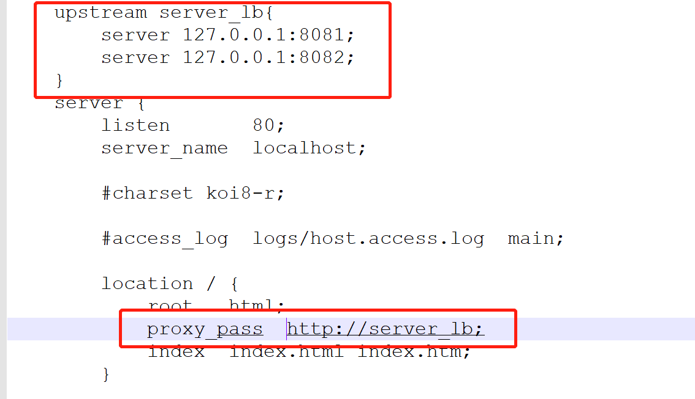

## 启动 - 测试

* 首先修改 **Tomcat** 的默认主页，以区分两个 **Tomcat**

  进入 **Tomcat** 目录下的 **webapps** 文件夹，再进入 **ROOT** 文件下，编辑 **index.jsp**

  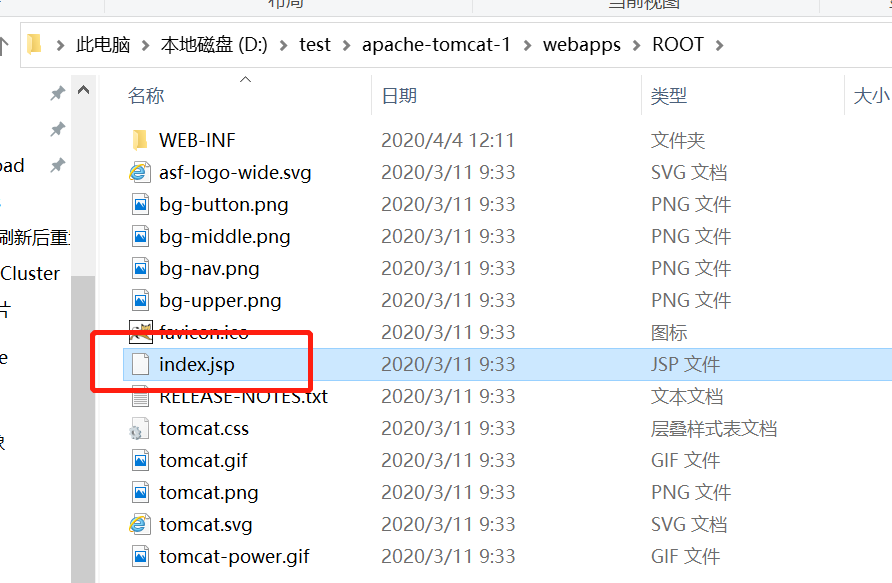

  在标题中做个标记

  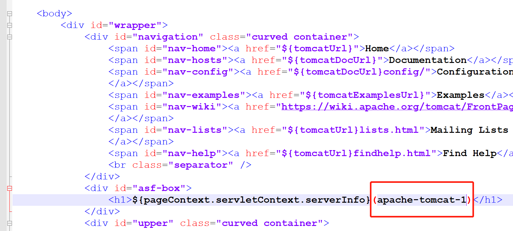

* 启动两个 **Tomcat**，进入 **Tomcat** 目录下的 **bin** 文件夹，打开 **startup.bat**

* 启动 **Nginx**，进入 **Nginx** 目录，打开 **nginx.exe**

* 打开浏览器，访问 **http://localhost/**。刷新页面，**Nginx** 会轮流访问两个 **Tomcat**

  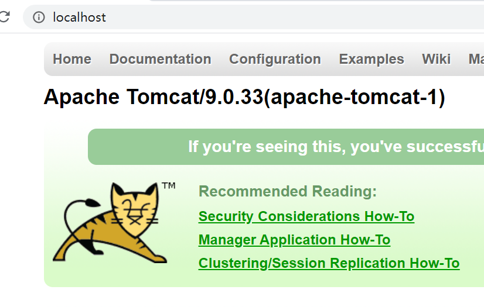

  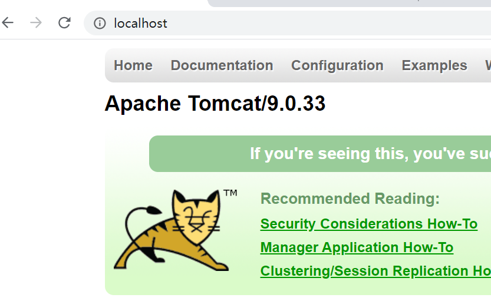

## 共享 Session

利用 `web` 容器本身的 `session` 共享策略来配置共享。针对于 `weblogic` 这种方式还是靠普的。但是针对于 `tomcat` 这种方式存在很大的缺陷，主要因为是依靠广播方式来实现的 `session` 复制，会浪费很多带宽导致整个网络反映缓慢。官网也建议这种方式最好不要超过 4 台 `tomcat` ,具体的内容可参考 `/webapps/docs/cluster-howto.html` 里面有详细的说明。

下面是具体的配置过程

修改 **Tomcat** 目录下 **conf** 文件下的 **server.xml**

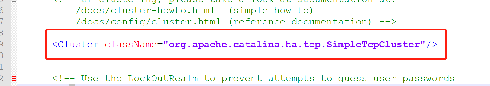

修改 **Tomcat** 目录下 **conf** 文件下的 **web.xml**

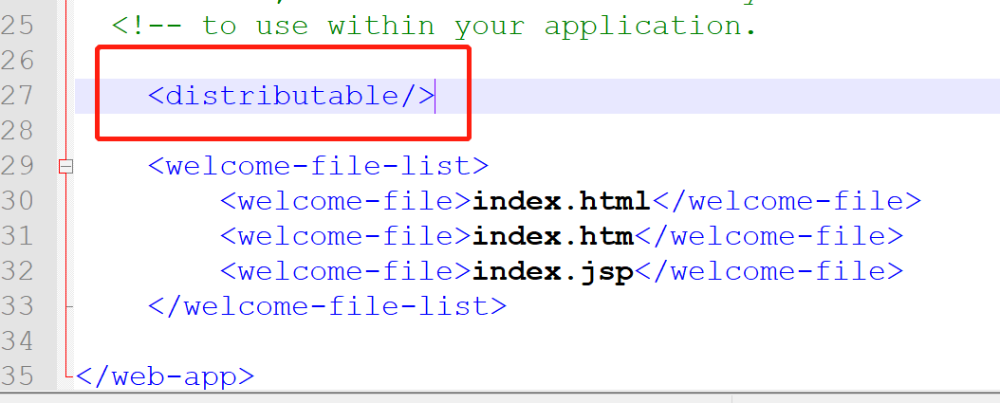