# subversion

[TOC]

## 版本控制

版本控制（Revision Control）：是维护工程蓝图的标准做法，能追踪工程蓝图从诞生一直到定案的过程。是一种记录若干 **文件内容变化**，以便将来查阅特定版本修订情况的系统。也是一种软体工程技巧，籍以在开发的过程中，确保由不同人所编辑的同一档案都得到更新。

## SVN

SVN（Subversion ），是一个开放源代码的版本控制系统，采用了分支管理系统，它的设计目标就是取代 CVS。

SVN 特点

* 统一的版本号。CVS是对每个文件顺序编排版本号，在某一时间各文件的版本号各不相同。而Subversion下，任何一次提交都会对所有文件增加到同一个新版本号，即使是提交并不涉及的文件。所以，各文件在某任意时间的版本号是相同的。版本号相同的文件构成软件的一个版本。
* 原子提交。一次提交不管是单个还是多个文件，都是作为一个整体提交的。在这当中发生的意外例如传输中断，不会引起数据库的不完整和数据损坏。
* 重命名、复制、删除文件等动作都保存在版本历史记录当中。
* 对于二进制文件，使用了节省空间的保存方法。（简单的理解，就是只保存和上一版本不同之处）
* 目录也有版本历史。整个目录树可以被移动或者复制，操作很简单，而且能够保留全部版本记录。 
* 分支的开销非常小。
* 优化过的数据库访问，使得一些操作不必访问数据库就可以做到。这样减少了很多不必要的和数据库主机之间的网络流量。 
* 支持元数据（Metadata）管理。每个目录或文件都可以定义属性（Property），它是一些隐藏的键值对，用户可以自定义属性内容，而且属性和文件内容一样在版本控制范围内。 
* 支持 FSFS 和 Berkeley DB 两种资料库格式。
* 不足：只能设置目录的访问权限，无法设置单个文件的访问权限。

## 下载路径

[官方下载路径 http://subversion.apache.org/packages.html](http://subversion.apache.org/packages.html)

## 命令

### 创建仓库

创建仓库的目录必须是空的，创建服务器仓库。

* 在指定的目录下创建仓库：`svnadmin create 目录路径`

  在 `D:\test\svn1` 下创建仓库

  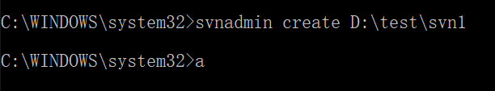

* 在当前目录下创建仓库：`svnadmin create .`

  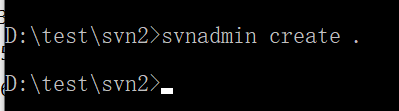

### 启动

命令 `svnserver -d -r 仓库路径`，启动服务时，指定 **仓库路径** 不同，分为 **多仓库** 和 **单仓库**。

* `-d`：后台执行
* `-r`：版本库的根目录

#### 多仓库

命令 `svnserve -d -r 多仓库的父目录`。**命令行窗口关闭则关闭服务**。

启动 `D:\test\svn1` 和 `D:\test\svn2` 两个仓库

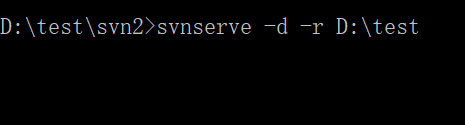

访问 `svn://localhost:3690/svn1` 和 `svn://localhost:3690/svn2`

#### 单仓库

命令 `svnserve -d -r 仓库的根`。**命令行窗口关闭则关闭服务**。

启动 `D:\test\svn1`

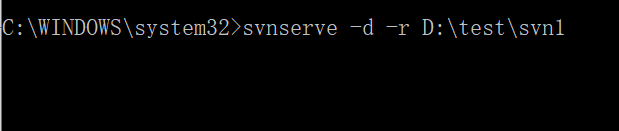

访问 `svn://localhost:3690`

#### 将操作注册成 windows 操作系统的服务

* 注册 **服务**

  `sc create 服务名称 binpath= "svn根目录\bin\svnserve.exe --service -r 仓库路径" displayname= "服务显示名称" start= auto depend=Tcpip`

  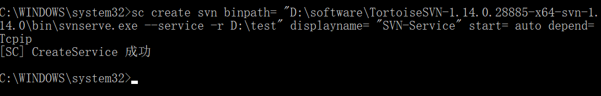

  * 启动服务

    `net start 服务名称`

    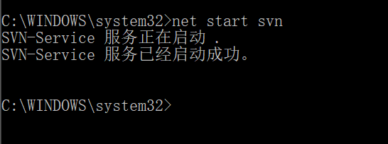

  * 关闭服务

    `net stop 服务名称`

    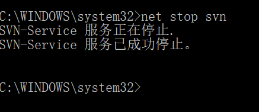

* 删除 **服务**

  `sc delete 服务名称`
  
  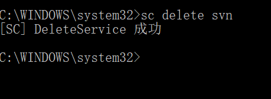

### checkout（下载）

命令 `svn checkout 服务器地址 下载地址`，将仓库下载到本地。

将 `svn://localhost:3690/svn1` 下载到本地 `D:\svn`

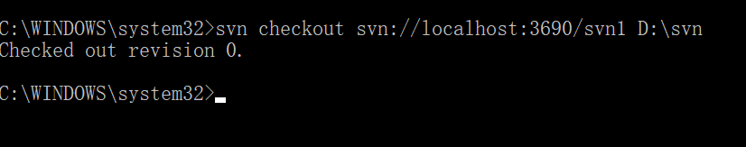

### add（将文件添加到本地版本库）

命令 `svn add 文件`，将文件添加到本地版本库。

将文件 `hehe.txt` 添加到本地版本库

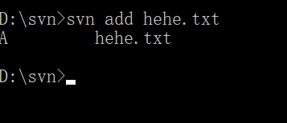

### commit（提交）

命令 `svn commit -m "提交的描述" 文件`，将文件提交到服务器仓库。

提交 **hehe.txt** 文件，提交的描述为 **提交 hehe.txt 文件**

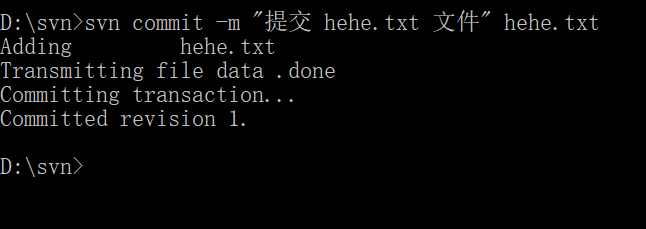

### update（更新）

命令 `svn update`，从服务器仓库下载最新版本文件。

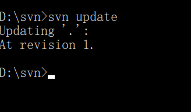

## SVN 权限

配置权限需要设置三个配置文件，服务器仓库的 `conf` 目录下。

* authz：全向认证配置
* passwd：账号配置
* svnserve.conf：核心配置文件，用于启动权限、确定账号文件位置、确定权限文件位置

### svnserve.conf

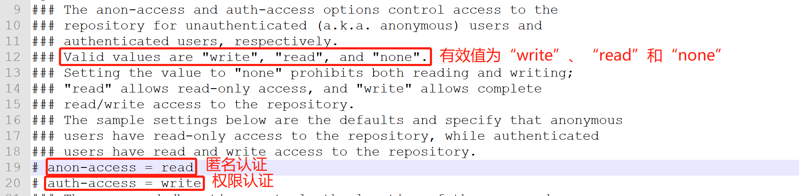

#### 开启匿名访问

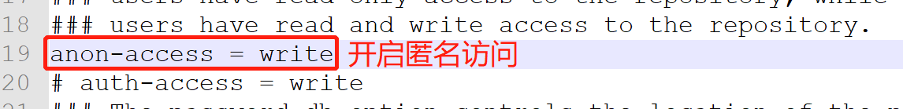

#### 开启权限认证

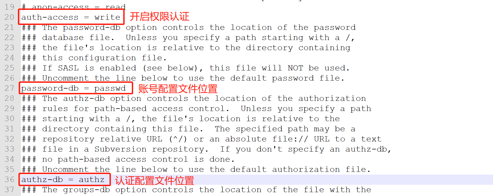

### passwd

账号配置文件。每行配置一个账号，账号用户名和密码组成，使用等号分隔。

新建 账号：`root`，密码：`root` 和 账号：`customer`，密码：`customer`

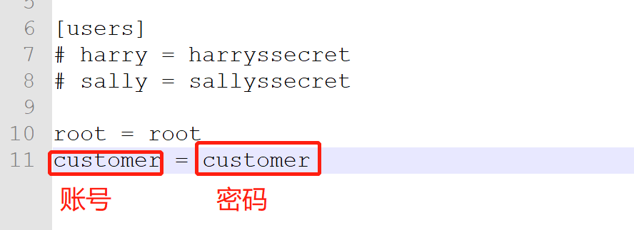

### authz

认证配置文件。

#### 配置组

格式：组名 = 用户 1，用户 2，。。。

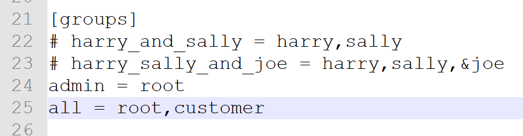

#### 多仓库

* `[repository:/baz/fuz]`：确定仓库名称。给 `repository` 仓库的 `baz/fuz` 目录配置权限
* `@harry_and_sally = rw`：给 `harry_and_sally` 组设置权限。read：`r`、read-write：`rw`、no access：`''`。
* `* = r`：给其他用户设置只读权限。

给 `svn1` 仓库配置权限，`admin` 组设置读写权限，`customer` 用户配置只读权限，其他用户没有权限。

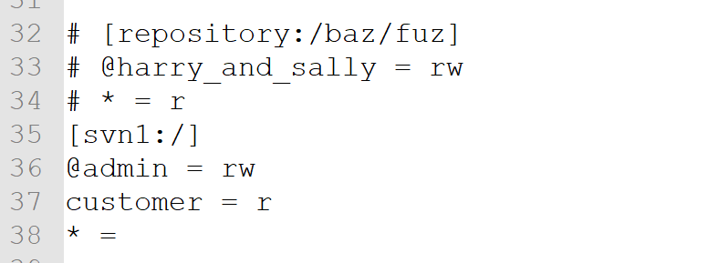

#### 单仓库

* `[/foo/bar]`：给 `foo/bar` 目录设置权限。给根目录设置权限 `[/]`。
* `harry = rw`：给 `harry` 用户设置读写权限。read：`r`、read-write：`rw`、no access：`''`。
* `* =`：给其他用户设置没有权限。

