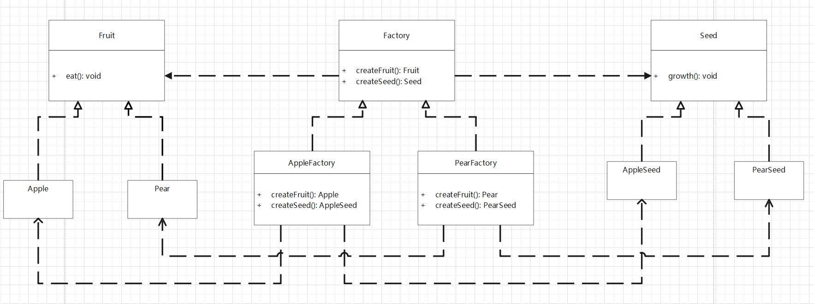
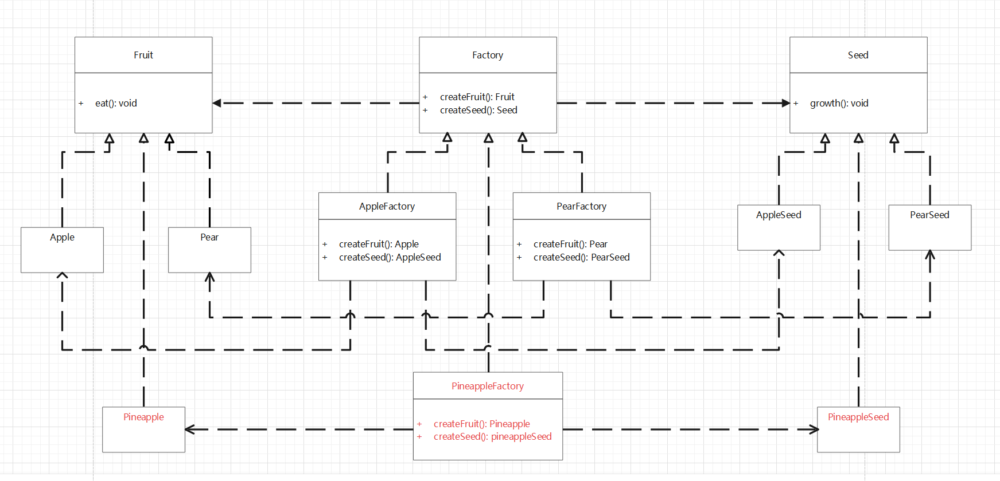
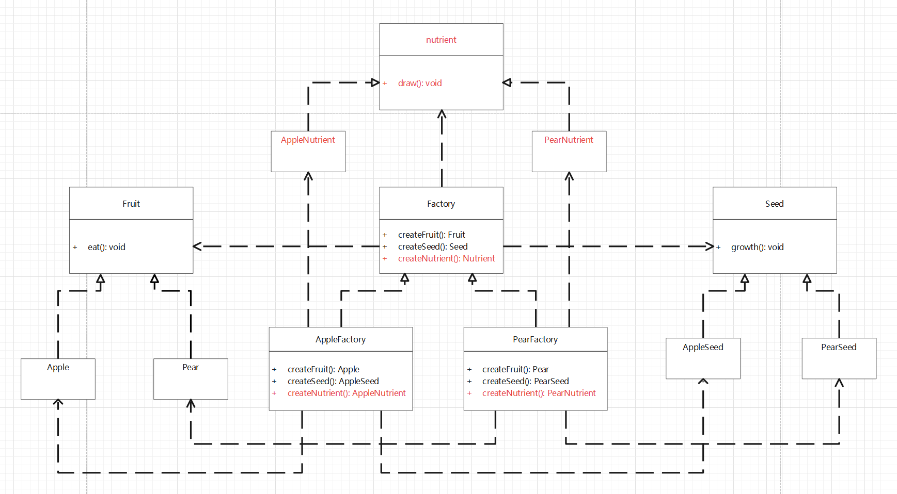

# 抽象工厂模式（Abstract Factory Pattern）

## 抽象工厂模式

如果要生产水果，那么产品是水果，产品的种类有多个，可以是苹果，也可以是梨子，而工厂方法模式就是使用苹果工厂来生产苹果，梨子工厂来生产梨子。此时来了水果商人，商人贩卖水果及其种子，这时候水果工厂除了生产苹果还要生产对应种子，也就是产品有多个（水果，种子），那么符合 **单一职责** 的工厂方法模式就不在适用了。

此时就需要升级工厂方法模式为抽象工厂模式，工厂将生产同系列的产品水果、种子，而生产那种水果和种子由专属的工厂来决定。例如，苹果工厂生成苹果和苹果种子，梨子工厂生成梨子和梨子种子。



**水果产品：**

[水果](design-patterns/creational-pattern/src/main/java/org/lzn/Fruit.java)

```java
public interface Fruit {
    void eat();
}
```

[苹果](design-patterns/creational-pattern/src/main/java/org/lzn/Apple.java)

```java
public class Apple implements Fruit {
    @Override
    public void eat() {
        System.out.println("吃苹果");
    }
}
```

[梨子](design-patterns/creational-pattern/src/main/java/org/lzn/Pear.java)

```java
public class Pear implements Fruit {
    @Override
    public void eat() {
        System.out.println("吃梨");
    }
}
```

**种子产品：**

[种子](design-patterns/creational-pattern/src/main/java/org/lzn/abstractfactory/Seed.java)

```java
public interface Seed {
    void grow();
}
```

[苹果种子](design-patterns/creational-pattern/src/main/java/org/lzn/abstractfactory/AppleSeed.java)

```java
public class AppleSeed implements Seed {
    @Override
    public void grow() {
        System.out.println("苹果种子发芽");
    }
}
```

[梨子种子](design-patterns/creational-pattern/src/main/java/org/lzn/abstractfactory/PearSeed.java)

```java
public class PearSeed implements Seed {
    @Override
    public void grow() {
        System.out.println("梨子种子发芽");
    }
}
```

**工厂：**

[工厂接口](design-patterns/creational-pattern/src/main/java/org/lzn/abstractfactory/Factory.java)

```java
public interface Factory {
    Fruit createFruit();
    Seed createSeed();
}
```

[苹果工厂](design-patterns/creational-pattern/src/main/java/org/lzn/abstractfactory/AppleFactory.java)

```java
public class AppleFactory implements Factory {
    @Override
    public Fruit createFruit() {
        // 复杂的构建逻辑
        return new Apple();
    }

    @Override
    public Seed createSeed() {
        // 复杂的构建逻辑
        return new AppleSeed();
    }
}
```

[梨子工厂](design-patterns/creational-pattern/src/main/java/org/lzn/abstractfactory/PearFactory.java)

```java
public class PearFactory implements Factory {
    @Override
    public Fruit createFruit() {
        // 复杂的构建逻辑
        return new Pear();
    }

    @Override
    public Seed createSeed() {
        // 复杂的构建逻辑
        return new PearSeed();
    }
}
```

[使用时](design-patterns/creational-pattern/src/main/java/org/lzn/abstractfactory/AbstractFactoryPattern.java)

```java
public class AbstractFactoryPattern {
    public static void main(String[] args) {
        // 水果系列
        Factory appleFactory = new AppleFactory();
        Fruit apple = appleFactory.createFruit();
        Seed appleSeed = appleFactory.createSeed();

        // 梨子系列
        Factory pearFactory = new PearFactory();
        Fruit pear = pearFactory.createFruit();
        Seed pearSeed = pearFactory.createSeed();
    }
}
```

这时若是需要添加产品的种类，例如，添加菠萝，则只需要添加一个新的工厂就行



这时若是添加新的产品，例如，添加肥料，则需要修改所有工厂



抽象工厂模式就是升级版的工厂方法模式

当抽象工厂模式只有一个产品时，就是工厂方法模式。

抽象工厂模式的扩展只具备一定 **开闭原则**。

* 当添加产品的种类时，只需要添加一个新的具体工厂，不需要修改代码，**满足开闭原则**
* 当添加新的产品时，所有工厂都需要修改，**不满足开闭原则**

